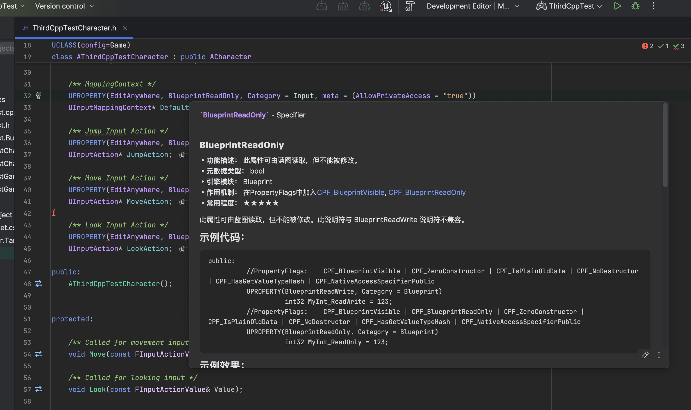

# UnrealSpecifierPlus

----
UnrealSpecifierPlus将最优秀的[Unreal标识符中文文档](https://github.com/fjz13/UnrealSpecifiers)集成入Rider和ReSharper中。

无需离开IDE，无需查找文档，即可快速浏览文档内容。

此仓库也可作为上手Rider与ReSharper插件开发的示例仓库。

----

## 相关内容

* [IntelliJ Platform SDK中文文档](https://github.com/beansoft/idea-docs)
* [Rider/ReSharper Plugin Templates](https://github.com/JetBrains/resharper-rider-plugin)